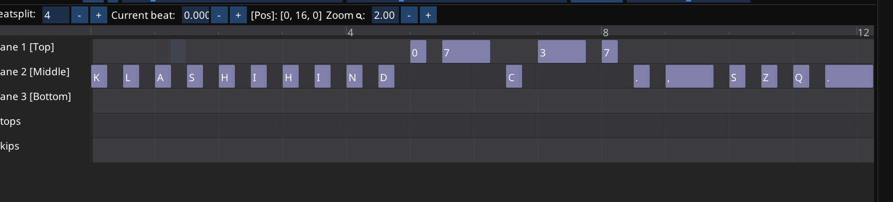

# Typing-Tempo-Auto-Chart
Typing Tempo Auto Chart
Enter songs_name beatPerBar bpm to_4_8_16_32_orSomeOther randomtype(0 for no random, 1 for yes)  


Example:
If I need to generate BetoRtallu - かたぎり(katagiri) - STRONG 280（Long ver.）.mp3, 4 beat in a bar, need to insert eighth-notes, bpm is 280, don't need random  
```
./generateType.exe "BetoRtallu - かたぎり(katagiri) - STRONG 280（Long ver.）.mp3" 4 280 8 0
```

## randomtype(0 for no random, 1 for yes)
if type 0, will put a key every ***to_4_8_16_32_orSomeOther note***
like 
and random will jump 1 or 2 note to join a key  